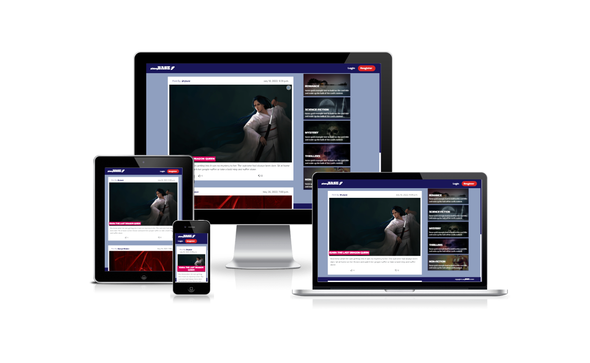
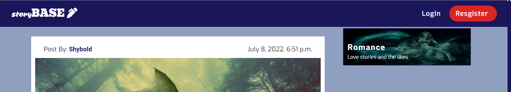
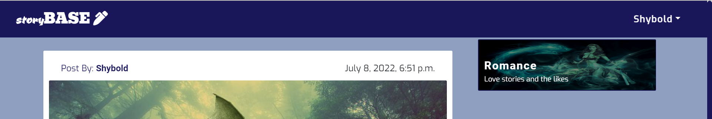
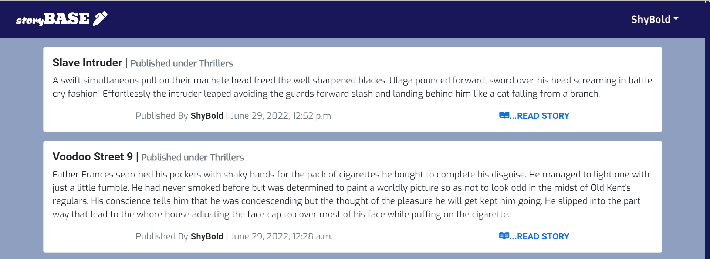

# StoryBase

StoryBase is a storytelling website created using Django framework. The site allows users to post thier creative ideas as story blogs. Stories are published into a set category chosen by the site admin. To post stories a site user must be registered and be logged in.

The site is responsive and can be easily asscesed with full functionality in full screen, tablet and mobile screen

## Features
Navigation bar containing site logo that is also a home button and a login link beside a call to action register button

If user is logged in the registered username appears as a link to the far right. On click the username drops down to a tab with links to view the logged in user profile, submit new story or logout of the site.

on the home page, post by site users are listed in rows to the left in order of new to old posts and peginated by 20 post.

To the right of the home page is a list of categories chosen by the site admin and can only be modified by the site admin. Each categorry has a link to a page with only post listed under that category.

site users need to be logged in to view the category page

each post can be viewed in detail by clicking the Title of the post this takes the site user to a detail view page where logged in users can interact with the post by liking or disliking the post or leaving a public comment.
site users not logged in are requested to do so to be able to interact with the post they are viewing.

### Features left to implement
*

### Data Model

### Testing
I have tested the code by doing the following:
* Passing the codes through a pep8 linter and confirming it has no errors. [pep8online check](pep8http://pep8online.com/checkresult)

* Tested it in my Terminal and the Code Institute Heroku Terminal.
* Entered invalid inputs and wrong inputs where inputs are requested with respect to integers and strings.
* Recruited help from friends to use app and offer feedback

### Bugs:
none found

### Deployment
The project was deployed to Heroku
. steps
1. create a Heroku account
2.  in the settings section reveal the config var and enter the key and value from the creds.json file
3. Add buildpack for python and nodejs respectively in the order the are listed here.
4. In the deploy section select github and search for the repository name. link up the Heroku app to the github repository code.
5. Scroll down and setup automatic deploy to allow Heroku to update app from gitpod push and click on the manual deploy option.
6. click view to view the app.

 View app here: [Medplus Pharmacy](https://medplus-pharmacy.herokuapp.com/)

### Credits
* Code Institute for the deployment terminal [Code Institute](https://codeinstitute.net/ie/)
* Ukachukwu Abimbola [@Nurse_Ukachukwu](https://twitter.com/nurse_ukachukwu) for external user testing.